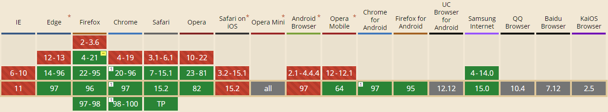

# 🍅 POMODORO TIMER ⏲️

[Try it out at pomodoro.artonwork.com](https://pomodoro.artonwork.com)

This is a PWA application.
The app saves your settings in local storage.

## Notifications only working in supported browsers.

## Available Scripts

### `yarn build` fails to minify

### `yarn start`

This project was bootstrapped with [Create React App](https://github.com/facebook/create-react-app).
